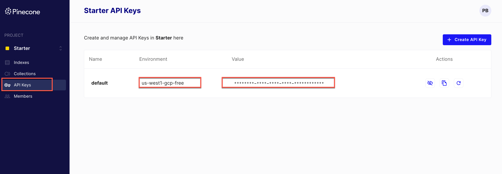

# Strapi Open AI Embeddings Plugin

The Strapi Cloud Content Embedding Plugin is designed to bridge the gap between your Strapi-managed content and your OpenAI chatbot.

By translating your data into meaningful text embedding, this plugin facilitates the delivery of intelligent, context-aware responses by your AI chatbot.

As a result, your AI chatbot gains the ability to comprehend and contextualize user inquiries based on your unique content.

With this plugin, your chatbot will no longer give canned responses. Instead, it becomes a virtual expert on your content, able to answer user questions with the contextual precision and nuance you've always aimed for.

At least, that is the goal.

The plugin is built as a starting point for you to either build on top of via "feature pull request" or clone and build your own variation.

It is entirely open source and is built by me with love and as a learning opportunity.

Feedback and improvements are welcomed.

Make sure to star on Git Hub if you like the effort that I put into it.

Thank you.

With love,

Paul

## Set Up Instructions

Before you start, you should have a Strapi project running locally where you would like to install the plugin.

If not, you can check out [Getting Started Guide](https://docs.strapi.io/dev-docs/quick-start) from Strapi's documentation. Otherwise, let's proceed to the next step.

### Prerequisites

- Open AI Account (might be paid)
- Pinecone Vector Database Account (free)
- A coffee

### Installation

Inside the root of your Strapi project, run the following command:

**using npm**

```bash
  npm install strapi-plugin-open-ai-embeddings
```

**using yarn**

```bash
  yarn add strapi-plugin-open-ai-embeddings
```

I will be using **yarn** in this example.

Within your strapi project, navigate to the `config` folder and create a `plugins.js` file unless one already exists and paste the following.

`config/plugins.js`

```javascript
module.exports = ({ env }) => ({
  "open-ai-embeddings": {
    enabled: true,
    config: {
      openAiApiKey: env("OPEN_AI_API_KEY"),
      openAiModelName: env("OPEN_AI_MODEL_NAME"),
      pineconeApiKey: env("PINECONE_API_KEY"),
      pineconeApiEnv: env("PINECONE_API_ENV"),
      pineconeIndex: env("PINECONE_INDEX"),
    },
  },
});
```

Now run the following command:

```bash
  yarn build && yarn develop
```

You should see the following error since we did not add our `env` variables. Which is a good sign.

```bash
  Failed to initialize Pinecone: PineconeError: Failed getting project
```

### Adding Our Env Variables

First, inside the root of your project, navigate to the `.env` file and add the following variables, which you will replace with your own credentials.

```env
  OPEN_AI_API_KEY=replace
  OPEN_AI_MODEL_NAME=gpt-3.5-turbo
  PINECONE_API_KEY=replace
  PINECONE_API_ENV=replace
  PINECONE_INDEX=replace
```

### Getting Your Open AI Credentials

Go to [OpenAI Account Settings](https://platform.openai.com/account/api-keys) and create your API key.


### Pinecone Vector Database

Go to [Pinecone.io](https://www.pinecone.io/) and create your free account.


Once your account is setup, let's create our first index.


- [ ] Give it a name.
- [ ] Add dimensions ( has to be 1536 for Open AI)
- [ ] Use the free Starter Plan
- [ ] Click Create Index

Once created, you should see the following screen.



Now that you have all your credentials, add them inside the `.env` file inside the root of your Strapi project.

``` env
  OPEN_AI_API_KEY=replace
  OPEN_AI_MODEL_NAME=gpt-3.5-turbo
  PINECONE_API_KEY=replace
  PINECONE_API_ENV=replace
  PINECONE_INDEX=replace
```

Restart your application by running `yarn develop`.

## Create Your First Embedding And Ask Question


## Plugin Demo Video

Will come soon


